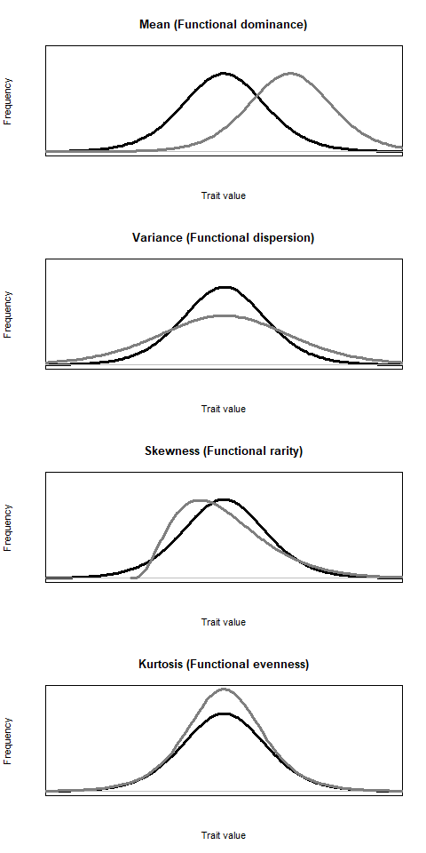
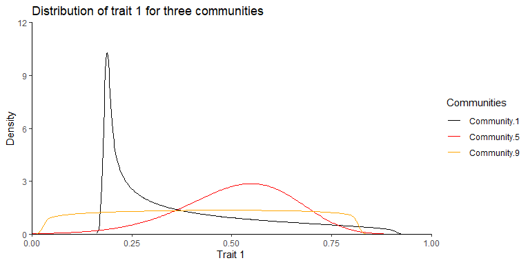

# TraitMoments

Efficient calculation of trait distribution moments.

<!-- badges: start -->

[](https://www.repostatus.org/#active)
[](https://www.tidyverse.org/lifecycle/#experimental)
[](https://www.gnu.org/licenses/gpl-3.0)
<!-- badges: end -->

TraitMoments provides an efficient function to calculate mean, variance,
skewness and kurtosis (all weighted by species relative abundance) of
trait distribution across large community and traits datasets. The
calculation is performed according to the equations number 1 to 4 from
Le Bagousse-Pinguet et al. (2017):

$$
\small
Mean_{j} = \sum_{i}^{n} p_i T_i
\tag{1}
$$

$$
\small
Variance_{j} = \sum_{i}^{n} p_i (T_i - Mean_j)^2
\tag{2}
$$

$$
\small
Skewness_{j} = \sum_{i}^{n} \frac{p_i (T_i - Mean_j)^3}{Variance_j^{\frac{3}{2}}}
\tag{3}
$$

$$
\small
Kurtosis_{j} = \sum_{i}^{n} \frac{p_i (T_i - Mean_j)^4}{Variance_j^2}
\tag{4}
$$

where $p_i$ is the relative abundance and $T_i$ the trait value of the
species *i*, *n* is the number of species in a community *j* with
available trait information and the sum of relative abundance is equal
to 100% for each community. Formulas 3 and 4 refer back to several works
by Karl Pearson from the late 19th and early 20th century, which had a
decisive influence on on the current understanding of skewness and
kurtosis (see Fiori & Zenga 2009 or Doane & Seward 2011 for an
overview).

The calculation of all moments enables detailed insights into the shape
of trait distributions. Enquist et al. (2015), Le Bagousse-Pinguet et
al. (2017) and Bagousse-Pinguet et al. (2021) linked the moments of
trait distributions to established frameworks of functional diversity
and proposed the following terminology: The community-weighted mean
(CWM) and the variance (CWV) allow for characterization of the
functional dominance and dispersion respectively, while the skewness
(CWS; asymmetry of a distributions) characterize the functional rarity
and the kurtosis (CWK; relative “tailedness” or “peakedness” of a
distribution) characterize the functional evenness. Negative or positive
skewness strongly deviating from zero indicates a high functional
rarity, while high kurtosis indicates a low functional evenness and vice
versa. A broader interpretation of skewed trait distributions was
proposed by Enquist et al. (2015): Skewed trait distributions indicate
past or ongoing species turnover and/or environmental change as there is
usually a time lag between growth and reproduction of immigrating
species and the mortality of suppressed species. Figure 1 shows the
precise relationship between moments and the shape of a distribution.

<div class="figure" style="text-align: center">


<p class="caption">
Figure 1: Relationship between moments and the shape of a distribution.
The graphs in grey show how the shape changes when the moment is
increased relative to the black graph. Figure modified according to Le
Bagousse-Pinguet et al. (2017) and Bagousse-Pinguet et al. (2021).
</p>

</div>

## Installation

Install the latest version from GitHub:

``` r
# install.packages("devtools") # Run if not yet installed
devtools::install_github("SchreinerFR/TraitMoments")
```

## Load package and view documentation

Load the package and call the documentation for the function
‘trait_moments’:

``` r
library(TraitMoments)
?trait_moments
```

## Explore example data

TraitMoments provides two example data frames. The data frame
‘communities’ contains the relative abundances for 93 species from 20
communities and ‘traits’ provides information on seven traits for the
corresponding species. For some species, no information is available for
certain traits, so the data frame ‘traits’ contains some NAs. Since both
data frames are quite large, we just inspect the heads in this example:

``` r
data(trait_moments_data)

communities[1:20,1:5] 
```

    ##               Species.1 Species.2 Species.3 Species.4 Species.5
    ##  Community.1      0.616     0.000     0.000     0.123     0.000
    ##  Community.2      0.000     0.000     0.000     0.000     0.000
    ##  Community.3      0.000     0.000     0.000     0.000     0.000
    ##  Community.4      0.000     0.000     0.000     0.788     0.000
    ##  Community.5      0.435     0.000     0.000     0.087     0.000
    ##  Community.6      0.000     0.000     0.000     0.000     0.000
    ##  Community.7      0.000     0.000     0.000     0.000     0.000
    ##  Community.8      0.000     0.000     0.000     0.000     0.000
    ##  Community.9      3.260     0.000     0.000     0.000     0.543
    ##  Community.10     0.000     0.000     0.000     0.000     0.000
    ##  Community.11    12.843     0.000     0.917     0.000     0.000
    ##  Community.12     0.384     0.077     0.000     0.000     0.000
    ##  Community.13     0.000     0.106     0.000     0.000     0.000
    ##  Community.14     0.000     0.000     0.000     0.000     0.000
    ##  Community.15     0.000     0.000     1.181     0.000     0.000
    ##  Community.16     3.498     0.000     0.000     0.000     0.000
    ##  Community.17     0.066     0.000     0.000     0.000     0.000
    ##  Community.18     1.225     0.000     0.000     0.000     0.000
    ##  Community.19     0.863     0.000     0.000     0.000     0.000
    ##  Community.20     0.078     0.000     0.000     0.000     0.000

``` r
traits[1:6,1:ncol(traits)] 
```

    ##           Trait.1 Trait.2 Trait.3 Trait.4 Trait.5 Trait.6 Trait.7
    ## Species.1   0.301   0.137  13.168   0.196   0.201 462.614  33.257
    ## Species.2   0.510   8.884  16.037   0.330   0.263 108.836  77.900
    ## Species.3   0.352   0.041  21.778   0.257   0.125 519.544  23.213
    ## Species.4   0.367   0.351  15.383   0.198      NA      NA      NA
    ## Species.5   0.450   3.435   9.438   0.161      NA      NA      NA
    ## Species.6   0.623   1.090  27.801   0.385   0.180 643.484  19.229

## Calculate moments using ‘trait_moments’

### First: with default settings

Now we use the function ‘trait_moments’ to calculate the moments of all
trait distributions for each trait and each community. The function will
perform the calculation for all 140 combinations of trait and community
at once. We just inspect the head of the result:

``` r
result1 <- trait_moments(communities = communities, traits = traits)
dim(result1)
```

    ## [1] 140   6

``` r
result1[1:20,1:ncol(result1)]
```

    ##           comID   Trait        mean     variance  skewness  kurtosis
    ## 1   Community.1 Trait.1   0.3712632 3.780533e-02 0.9893821  2.879616
    ## 2   Community.1 Trait.2   1.9322662 6.481573e+00 1.7553168  4.834195
    ## 3   Community.1 Trait.3  25.2494601 7.361035e+01 1.7575311  5.510149
    ## 4   Community.1 Trait.4   0.2665842 5.976908e-03 0.1038558  1.574355
    ## 5   Community.1 Trait.5          NA           NA        NA        NA
    ## 6   Community.1 Trait.6          NA           NA        NA        NA
    ## 7   Community.1 Trait.7          NA           NA        NA        NA
    ## 8   Community.2 Trait.1   0.3682247 2.280394e-02 0.9134265  2.827577
    ## 9   Community.2 Trait.2   1.8881360 1.669666e+00 5.7630204 72.454621
    ## 10  Community.2 Trait.3          NA           NA        NA        NA
    ## 11  Community.2 Trait.4   0.2546775 5.550581e-03 0.7447191  1.974249
    ## 12  Community.2 Trait.5          NA           NA        NA        NA
    ## 13  Community.2 Trait.6          NA           NA        NA        NA
    ## 14  Community.2 Trait.7          NA           NA        NA        NA
    ## 15  Community.3 Trait.1   0.3632065 3.431266e-02 0.4142637  2.012993
    ## 16  Community.3 Trait.2   1.3657087 2.176708e+00 4.7863333 41.165863
    ## 17  Community.3 Trait.3  25.2751153 3.490479e+01 0.5570684  3.036251
    ## 18  Community.3 Trait.4   0.2560935 4.201779e-03 0.8421748  2.377324
    ## 19  Community.3 Trait.5   0.1780019 1.168883e-03 0.6644317  3.194599
    ## 20  Community.3 Trait.6 393.2426040 2.814202e+04 0.5837986  1.743921

### Second: with settings to control the trade-off between reliable results and the number of NAs obtained

The first attempt resulted in a data frame that contains several NAs.
This is because ‘trait_moments’ with default settings returns an NA if
the cumulative relative abundance of the species for which trait
information is available is less than 80% or if there is missing
information for at leased one of the four most dominant species. Many
studies use a threshold value of 80% cumulative relative abundance for
the calculation of community-weighted means (Bello et al. 2021). For the
calculation of trait distribution moments, Le Bagousse-Pinguet et
al. (2017) introduced the additional threshold that, trait data should
be available for the four most dominant species to avoid any breaks in
the trait distributions. I strongly recommend applying these or even
stricter criteria in order to obtain reliable results. However,
‘trait_moments’ contains arguments to control the trade-off between
reliable results and the number of NAs obtained. By setting the
arguments ‘n_species = 1’ and ‘abundance = 50’ we get a result that
contains less NAs.

``` r
result2 <- trait_moments(communities = communities, traits = traits, n_species = 1, abundance = 50)
```

    ## Warning in trait_moments(communities = communities, traits = traits, n_species
    ## = 1, : Calculations with n_species < 4 may lead to unreliable results.

``` r
result2[1:20,1:ncol(result2)]
```

    ##           comID   Trait        mean     variance   skewness  kurtosis
    ## 1   Community.1 Trait.1   0.3712632 3.780533e-02  0.9893821  2.879616
    ## 2   Community.1 Trait.2   1.9322662 6.481573e+00  1.7553168  4.834195
    ## 3   Community.1 Trait.3  25.2494601 7.361035e+01  1.7575311  5.510149
    ## 4   Community.1 Trait.4   0.2665842 5.976908e-03  0.1038558  1.574355
    ## 5   Community.1 Trait.5   0.1703279 7.715864e-04  2.3762906  7.498506
    ## 6   Community.1 Trait.6 526.1652640 4.385980e+04 -0.2971057  1.896046
    ## 7   Community.1 Trait.7  46.9193074 2.883443e+02  2.6094318 12.104186
    ## 8   Community.2 Trait.1   0.3682247 2.280394e-02  0.9134265  2.827577
    ## 9   Community.2 Trait.2   1.8881360 1.669666e+00  5.7630204 72.454621
    ## 10  Community.2 Trait.3  24.2974731           NA         NA        NA
    ## 11  Community.2 Trait.4   0.2546775 5.550581e-03  0.7447191  1.974249
    ## 12  Community.2 Trait.5   0.1709812           NA         NA        NA
    ## 13  Community.2 Trait.6 449.8115659           NA         NA        NA
    ## 14  Community.2 Trait.7  50.5679543           NA         NA        NA
    ## 15  Community.3 Trait.1   0.3632065 3.431266e-02  0.4142637  2.012993
    ## 16  Community.3 Trait.2   1.3657087 2.176708e+00  4.7863333 41.165863
    ## 17  Community.3 Trait.3  25.2751153 3.490479e+01  0.5570684  3.036251
    ## 18  Community.3 Trait.4   0.2560935 4.201779e-03  0.8421748  2.377324
    ## 19  Community.3 Trait.5   0.1780019 1.168883e-03  0.6644317  3.194599
    ## 20  Community.3 Trait.6 393.2426040 2.814202e+04  0.5837986  1.743921

Conversely, the two arguments can also be used to apply stricter quality
criteria. This could be appropriate if trait information is available
for a large number of species.

## Visualisation and ecological interpretation of trait distributions

Functions to visualise trait distributions are not yet available in
‘TraitMoments’, but I intend to implement it in later versions. There
are basically two different ways to visualise trait distributions,
either in the manner of histograms or as density estimation based on
calculated moments. In the following I will demonstrate both approaches
for the distributions of Trait 1 for Community 1, 5 and 9.

To prepare for visualisation as histogram, the abundance of the species
for the three communities will be selected from the data frame
‘community’ and joined with the values for trait 1. The species are then
divided into groups according to their trait values and within each
group the sum of the relative abundances is calculated. Each group has
the same range and the number of groups corresponds to the number of
bars in the histogram:

``` r
# install.packages("tidyverse") # Run if not yet installed
library(tidyverse)

selected_communities <- as.data.frame(t(
  rbind(
  communities[1, 1:ncol(communities)],
  communities[5, 1:ncol(communities)],
  communities[9, 1:ncol(communities)],
  Trait.1 = traits$Trait.1
  )))
selected_communities[selected_communities == 0] <- NA

selected_communities$group <- "0.0 - 0.2"
selected_communities[selected_communities$Trait.1 > 0.2, ]$group <- "0.2 - 0.4"
selected_communities[selected_communities$Trait.1 > 0.4, ]$group <- "0.5 - 0.6"
selected_communities[selected_communities$Trait.1 > 0.6, ]$group <- "0.6 - 0.8"
selected_communities[selected_communities$Trait.1 > 0.8, ]$group <- "0.8 - 1.0"

hist_data <- selected_communities %>% 
    group_by(group) %>%
    summarise(
      Community.1 = sum(` Community.1`, na.rm=TRUE),
      Community.5 = sum(` Community.5`, na.rm=TRUE),
      Community.9 = sum(` Community.9`, na.rm=TRUE))
```

To perform a density estimation based on the calculated moments, we
first select the moments provided by ‘trait_moments’ for the three
distributions and use the package ‘PearsonDS’ to generate the input for
the density estimation:

``` r
selected_results <- rbind(
  result1[1, 1:ncol(result1)],
  result1[29, 1:ncol(result1)],
  result1[57, 1:ncol(result1)]
  )

# install.packages("PearsonDS") # Run if not yet installed
library(PearsonDS)
set.seed(123)
pearson_generation  <- rpearson(10000000,moments=c(mean = selected_results[1,3], variance = selected_results[1,4], skewness = selected_results[1,5], kurtosis = selected_results[1,6]))
dens_Community.1_Trait.1 <- density(pearson_generation)

pearson_generation  <- rpearson(10000000,moments=c(mean = selected_results[2,3], variance = selected_results[2,4], skewness = selected_results[2,5], kurtosis = selected_results[2,6]))
dens_Community.5_Trait.1 <- density(pearson_generation)

pearson_generation  <- rpearson(10000000,moments=c(mean = selected_results[3,3], variance = selected_results[3,4], skewness = selected_results[3,5], kurtosis = selected_results[3,6]))
dens_Community.9_Trait.1 <- density(pearson_generation)
```

Finally, we plot the density estimation based on calculated moments next
to the corresponding histograms:

``` r
par(mfrow = c(3, 2))
plot(dens_Community.1_Trait.1, type="l", xlab="Trait value", ylab="Frequency", yaxt='n', main = "Community 1 Trait 1", xlim = c(0,1))
barplot(hist_data$Community.1, names.arg = hist_data$group, xlab="Trait value",ylab="Frequency", yaxt='n', main = "Community 1 Trait 1")
plot(dens_Community.5_Trait.1, type="l", xlab="Trait value", ylab="Frequency", yaxt='n', main = "Community 5 Trait 1", xlim = c(0,1))
barplot(hist_data$Community.5, names.arg = hist_data$group, xlab="Trait value", ylab="Frequency", yaxt='n', main = "Community 5 Trait 1")
plot(dens_Community.9_Trait.1, type="l",xlab="Trait value",ylab="Frequency", yaxt='n', main = "Community 9 Trait 1", xlim = c(0,1))
barplot(hist_data$Community.9, names.arg = hist_data$group, xlab="Trait value", ylab="Frequency", yaxt='n', main = "Community 9 Trait 1")
```

<div class="figure" style="text-align: center">


<p class="caption">
Figure 2: Distributions for trait 1 in the communies 1, 5 and 9 as
density estimation based on calculated moments (left paneles) and
histograms (right panels).
</p>

</div>

In order to interpret the visualisation together with the corresponding
moments, we take a look at the values obtained from ‘trait_moments’ for
the three distributions.

``` r
selected_results
```

    ##           comID   Trait      mean   variance    skewness kurtosis
    ## 1   Community.1 Trait.1 0.3712632 0.03780533  0.98938208 2.879616
    ## 29  Community.5 Trait.1 0.5123564 0.02075514 -0.52523160 3.467144
    ## 57  Community.9 Trait.1 0.4290831 0.04832341 -0.02898023 1.857378

First, we can state that the density estimations based on calculated
moments and the histograms based on species trait values and abundance
correspond quite well. We also note that the shape of the distributions
is very distinct across the three communities. If we had only calculated
the mean values and perhaps a measure for the dispersion - as is the
case in many studies - some of these differences would have remained
hidden. As mean and variance are regularly considered in functional
ecology studies, I will emphasise how the distributions differ in terms
of skewness and kurtosis.

Skewness is a measure of the asymmetry of a distribution. Community 1 is
strongly skewed to the right (positive skew), while community 5 is
slightly skewed to the left (negative skew) and community 9 is almost
symmetric (skew close to zero). Applying the terminology of Le
Bagousse-Pinguet et al. (2021) to the three distributions, we could
conclude that community 1 is characterised by a high functional rarity,
as there are many rare species with infrequent trait values compared to
the dominant species. In contrast, community 9 would be characterised by
a very low functional rarity, as there are no rare species with uncommon
trait values.

Furthermore the three distributions differ with regard to the fourth
moment, the kurtosis which is a characterization of a distributions
“tailedness” or “peakedness”. Community 1 is quite peaked around a value
of approximately 0.2, but also has a tail that extends far to the right.
Although the distribution for community 5 looks less peaked at first
glance, it has the highest kurtosis, as its tails are less pronounced
than those of community 1. The distribution for community 9 has the
least marked peak and short tails, i.e. a low kurtosis, which in the
sense of Le Bagousse-Pinguet et al. (2021) would be indicative for a
high functional evenness.

## Final note on community-weighted means (CWMs)

The function ‘functcomp’ from the package ‘FD’ is frequently used to
calculate CWMs. In the following I will demonstrate that ‘functcomp’ and
‘trait_moments’ return exactly the same values, however ‘trait_moments’
enables to specify a threshold for the cumulative relative abundance for
which trait information should be present.

First we inspect the output of ‘functcomp’:

``` r
# install.packages("FD") # Run if not yet installed
library(FD)
functcomp(traits, as.matrix(communities))
```

    ##                 Trait.1   Trait.2  Trait.3   Trait.4   Trait.5  Trait.6
    ##  Community.1  0.3712632 1.9322662 25.24946 0.2665842 0.1703279 526.1653
    ##  Community.2  0.3682247 1.8881360 24.29747 0.2546775 0.1709812 449.8116
    ##  Community.3  0.3632065 1.3657087 25.27512 0.2560935 0.1780019 393.2426
    ##  Community.4  0.3811159 1.9149424 23.27707 0.2426073 0.1637136 358.2514
    ##  Community.5  0.5123564 0.7964910 28.55506 0.3125389 0.1692971 660.3667
    ##  Community.6  0.4751660 1.4579151 26.48925 0.3282806 0.1689189 592.1743
    ##  Community.7  0.4867108 1.0830827 26.35966 0.3162772 0.1732276 583.8424
    ##  Community.8  0.4470184 1.6316159 28.21369 0.2530926 0.1792957 587.6828
    ##  Community.9  0.4290831 0.8764628 29.50864 0.2411785 0.1766395 467.6702
    ##  Community.10 0.4418119 1.4422199 26.44595 0.2931464 0.1644011 466.0580
    ##  Community.11 0.3034360 1.1261080 21.52880 0.2275060 0.1656922 368.1995
    ##  Community.12 0.3659137 0.7369823 25.47576 0.3027423 0.1868506 620.4438
    ##  Community.13 0.5509309 1.5712642 30.09570 0.2964283 0.1757242 438.8306
    ##  Community.14 0.7398152 1.3748145 22.68648 0.3307889 0.1668576 435.8533
    ##  Community.15 0.3101390 0.3396962 20.72024 0.3590328 0.1601501 634.8599
    ##  Community.16 0.5486278 2.5660729 28.55636 0.2842398 0.1660446 382.7780
    ##  Community.17 0.2938275 1.3771540 20.33044 0.2581845 0.1547385 361.9837
    ##  Community.18 0.3950641 1.2848238 21.12149 0.3476057 0.1634484 569.1079
    ##  Community.19 0.3846099 1.3888590 22.07469 0.3042461 0.1666712 473.7587
    ##  Community.20 0.4395533 2.2494183 25.05191 0.2843483 0.1741213 394.5652
    ##                Trait.7
    ##  Community.1  46.91931
    ##  Community.2  50.56795
    ##  Community.3  48.80059
    ##  Community.4  54.04048
    ##  Community.5  51.25072
    ##  Community.6  61.46722
    ##  Community.7  38.98142
    ##  Community.8  42.05538
    ##  Community.9  72.37432
    ##  Community.10 75.95275
    ##  Community.11 54.45343
    ##  Community.12 46.08488
    ##  Community.13 34.85688
    ##  Community.14 63.81661
    ##  Community.15 38.92802
    ##  Community.16 33.70617
    ##  Community.17 54.76690
    ##  Community.18 56.43328
    ##  Community.19 78.73747
    ##  Community.20 82.01235

As already stated above, in many cases it is advisable to set a
threshold value of 80 % for the cumulative relative abundance. This can
be achieved via ‘trait_moments’ if we set ‘n_species = 0’ and ‘abundance
= 80’:

``` r
result <- trait_moments(communities, traits, n_species = 0, abundance = 80)
```

    ## Warning in trait_moments(communities, traits, n_species = 0, abundance = 80):
    ## If n_species = 0 no moments but only cwms can be calculated.

    ## Warning in trait_moments(communities, traits, n_species = 0, abundance = 80):
    ## Calculations with n_species < 4 may lead to unreliable results.

``` r
result[1:20,1:ncol(result)]
```

    ##           comID   Trait        mean variance skewness kurtosis
    ## 1   Community.1 Trait.1   0.3712632       NA       NA       NA
    ## 2   Community.1 Trait.2   1.9322662       NA       NA       NA
    ## 3   Community.1 Trait.3  25.2494601       NA       NA       NA
    ## 4   Community.1 Trait.4   0.2665842       NA       NA       NA
    ## 5   Community.1 Trait.5          NA       NA       NA       NA
    ## 6   Community.1 Trait.6          NA       NA       NA       NA
    ## 7   Community.1 Trait.7          NA       NA       NA       NA
    ## 8   Community.2 Trait.1   0.3682247       NA       NA       NA
    ## 9   Community.2 Trait.2   1.8881360       NA       NA       NA
    ## 10  Community.2 Trait.3          NA       NA       NA       NA
    ## 11  Community.2 Trait.4   0.2546775       NA       NA       NA
    ## 12  Community.2 Trait.5          NA       NA       NA       NA
    ## 13  Community.2 Trait.6          NA       NA       NA       NA
    ## 14  Community.2 Trait.7          NA       NA       NA       NA
    ## 15  Community.3 Trait.1   0.3632065       NA       NA       NA
    ## 16  Community.3 Trait.2   1.3657087       NA       NA       NA
    ## 17  Community.3 Trait.3  25.2751153       NA       NA       NA
    ## 18  Community.3 Trait.4   0.2560935       NA       NA       NA
    ## 19  Community.3 Trait.5   0.1780019       NA       NA       NA
    ## 20  Community.3 Trait.6 393.2426040       NA       NA       NA

We receive a warning that CWMs but no moments can be calculated if we
set ‘n_species = 0’. Since this is our goal in this special case we can
ignore this warning. ‘Trait_moments’ generates exactly the same CWMs as
‘functcomp’, but if there is not suficient trait information to obtain
reliable results (level can be chosen by the user), it returns NAs. If
we set ‘n_species = 0’ and ‘abundance = 0’, the two functions return
exactly the same result.

# Citation

Please cite as:

> Falk-Rudhard Schreiner (2024). TraitMoments: Efficient calculation of
> trait distribution moments. Available from:
> <https://github.com/SchreinerFR/TraitMoments>.

# References

Bello, F. de, Carmona, C.P., Dias, A.T.C., Götzenberger, L., Moretti, M.
& Berg, M.P. (2021) Handbook of Trait-Based Ecology. Cambridge
University Press.

Doane, D.P. & Seward, L.E. (2011) Measuring Skewness: A Forgotten
Statistic? Journal of Statistics Education, 19(2). Available from:
<https://doi.org/10.1080/10691898.2011.11889611>.

Enquist, B.J., Norberg, J., Bonser, S.P., Violle, C., Webb, C.T. &
Henderson, A. et al. (2015) Chapter Nine - Scaling from Traits to
Ecosystems: Developing a General Trait Driver Theory via Integrating
Trait-Based and Metabolic Scaling Theories. In: Pawar, S., Woodward, G.
& Dell, A.I. (Eds.) Trait-Based Ecology - From Structure to Function.
Academic Press.

Fiori, A.M. & Zenga, M. (2009) Karl Pearson and the Origin of Kurtosis.
International Statistical Review, 77(1), 40–50. Available from:
<https://doi.org/10.1111/j.1751-5823.2009.00076.x>.

Le Bagousse-Pinguet, Y., Gross, N., Maestre, F.T., Maire, V., Bello, F.
de & Fonseca, C.R. et al. (2017) Testing the environmental filtering
concept in global drylands. Journal of Ecology, 105(4), 1058–1069.
Available from: <https://doi.org/10.1111/1365-2745.12735>.

Le Bagousse-Pinguet, Y., Gross, N., Saiz, H., Maestre, F.T., Ruiz, S. &
Dacal, M. et al. (2021) Functional rarity and evenness are key facets of
biodiversity to boost multifunctionality. Proceedings of the National
Academy of Sciences of the United States of America, 118(7). Available
from: <https://doi.org/10.1073/pnas.2019355118>.
