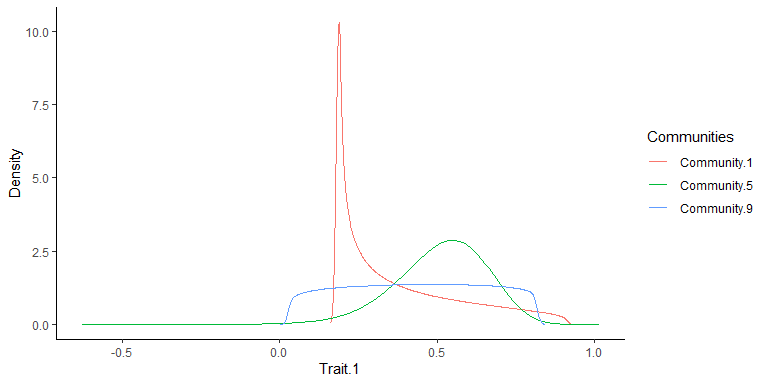

# TraitMoments

Efficient calculation and visualization of trait distribution moments.

<!-- badges: start -->

[](https://www.repostatus.org/#active)
[](https://www.tidyverse.org/lifecycle/#experimental)
[](https://www.gnu.org/licenses/gpl-3.0)
<!-- badges: end -->

TraitMoments provides an efficient function to calculate mean, variance,
skewness and kurtosis (all weighted by species relative abundance) of
trait distribution across large community and traits datasets. The
calculation is performed according to the equations number 1 to 4 from
Le Bagousse-Pinguet et al. (2017):

$$
\small
Mean_{j} = \sum_{i}^{n} p_i T_i
\tag{1}
$$

$$
\small
Variance_{j} = \sum_{i}^{n} p_i (T_i - Mean_j)^2
\tag{2}
$$

$$
\small
Skewness_{j} = \sum_{i}^{n} \frac{p_i (T_i - Mean_j)^3}{Variance_j^{\frac{3}{2}}}
\tag{3}
$$

$$
\small
Kurtosis_{j} = \sum_{i}^{n} \frac{p_i (T_i - Mean_j)^4}{Variance_j^2}
\tag{4}
$$

where $p_i$ is the relative abundance and $T_i$ the trait value of the
species *i*, *n* is the number of species in a community *j* with
available trait information and the sum of relative abundance is equal
to 100% for each community. Formulas 3 and 4 refer back to several works
by Karl Pearson from the late 19th and early 20th century, which had a
decisive influence on on the current understanding of skewness and
kurtosis (see Fiori & Zenga 2009 or Doane & Seward 2011 for an
overview).

The calculation of all moments enables detailed insights into the shape
of trait distributions. Enquist et al. (2015), Le Bagousse-Pinguet et
al. (2017) and Bagousse-Pinguet et al. (2021) linked the moments of
trait distributions to established frameworks of functional diversity
and proposed the following terminology: The community-weighted mean
(CWM) and the variance (CWV) allow for characterization of the
functional dominance and dispersion respectively, while the skewness
(CWS; asymmetry of a distributions) characterize the functional rarity
and the kurtosis (CWK; relative “tailedness” or “peakedness” of a
distribution) characterize the functional evenness. Negative or positive
skewness strongly deviating from zero indicates a high functional
rarity, while high kurtosis indicates a low functional evenness and vice
versa. A broader interpretation of skewed trait distributions was
proposed by Enquist et al. (2015): Skewed trait distributions indicate
past or ongoing species turnover and/or environmental change as there is
usually a time lag between growth and reproduction of immigrating
species and the mortality of suppressed species. Figure 1 shows the
precise relationship between moments and the shape of a distribution.

<div class="figure" style="text-align: center">


<p class="caption">
Figure 1: Relationship between moments and the shape of a distribution.
The graphs in grey show how the shape changes when the moment is
increased relative to the black graph. Figure modified according to Le
Bagousse-Pinguet et al. (2017) and Bagousse-Pinguet et al. (2021).
</p>

</div>

## Installation

Install the latest version from GitHub:

``` r
# install.packages("devtools") # Run if not yet installed
devtools::install_github("SchreinerFR/TraitMoments")
```

## Load package and view documentation

Load the package and call the documentation for the functions
‘trait_moments’ and ‘visualise_moments’:

``` r
library(TraitMoments)
?trait_moments
?visualise_moments
```

## Explore example data

TraitMoments comes with two example data frames that can be loaded with
‘data(trait_moments_data)’. The data frame ‘communities’ contains the
relative abundances for 93 species from nine communities and ‘traits’
provides information on five traits for the corresponding species. For
some species, no information is available for certain traits, so the
data frame ‘traits’ contains some NAs. Since both data frames are quite
large, we just inspect the heads in this example:

``` r
data(trait_moments_data)

communities[1:9,1:6] 
```

    ##              Species.1 Species.2 Species.3 Species.4 Species.5 Species.6
    ##  Community.1     0.616         0         0     0.123     0.000     0.123
    ##  Community.2     0.000         0         0     0.000     0.000    11.834
    ##  Community.3     0.000         0         0     0.000     0.000    10.473
    ##  Community.4     0.000         0         0     0.788     0.000     3.941
    ##  Community.5     0.435         0         0     0.087     0.000     8.706
    ##  Community.6     0.000         0         0     0.000     0.000    10.766
    ##  Community.7     0.000         0         0     0.000     0.000     7.201
    ##  Community.8     0.000         0         0     0.000     0.000    10.447
    ##  Community.9     3.260         0         0     0.000     0.543     0.000

``` r
traits[1:6,1:5] 
```

    ##           Trait.1 Trait.2 Trait.3 Trait.4 Trait.5
    ## Species.1   0.301   0.137  13.168   0.196   0.201
    ## Species.2   0.510   8.884  16.037   0.330   0.263
    ## Species.3   0.352   0.041  21.778   0.257   0.125
    ## Species.4   0.367   0.351  15.383   0.198      NA
    ## Species.5   0.450   3.435   9.438   0.161      NA
    ## Species.6   0.623   1.090  27.801   0.385   0.180

## Calculate moments using ‘trait_moments’

### First: with default settings

Now we use the function ‘trait_moments’ to calculate the moments of all
trait distributions for each trait and each community. The function will
perform the calculation for all 45 combinations of trait and community
at once.

``` r
result1 <- trait_moments(communities = communities, traits = traits)
result1
```

    ##           comID   Trait       mean     variance    skewness   kurtosis
    ## 1   Community.1 Trait.1  0.3712632 3.780533e-02  0.98938208   2.879616
    ## 2   Community.1 Trait.2  1.9322662 6.481573e+00  1.75531682   4.834195
    ## 3   Community.1 Trait.3 25.2494601 7.361035e+01  1.75753106   5.510149
    ## 4   Community.1 Trait.4  0.2665842 5.976908e-03  0.10385579   1.574355
    ## 5   Community.1 Trait.5         NA           NA          NA         NA
    ## 6   Community.2 Trait.1  0.3682247 2.280394e-02  0.91342645   2.827577
    ## 7   Community.2 Trait.2  1.8881360 1.669666e+00  5.76302039  72.454621
    ## 8   Community.2 Trait.3         NA           NA          NA         NA
    ## 9   Community.2 Trait.4  0.2546775 5.550581e-03  0.74471912   1.974249
    ## 10  Community.2 Trait.5         NA           NA          NA         NA
    ## 11  Community.3 Trait.1  0.3632065 3.431266e-02  0.41426372   2.012993
    ## 12  Community.3 Trait.2  1.3657087 2.176708e+00  4.78633333  41.165863
    ## 13  Community.3 Trait.3 25.2751153 3.490479e+01  0.55706837   3.036251
    ## 14  Community.3 Trait.4  0.2560935 4.201779e-03  0.84217477   2.377324
    ## 15  Community.3 Trait.5  0.1780019 1.168883e-03  0.66443173   3.194599
    ## 16  Community.4 Trait.1  0.3811159 3.637074e-02  0.91192932   3.032825
    ## 17  Community.4 Trait.2  1.9149424 4.877729e+00  2.45813728   7.842963
    ## 18  Community.4 Trait.3 23.2770717 2.514515e+01  0.32854089   2.266522
    ## 19  Community.4 Trait.4  0.2426073 3.315517e-03  1.31765879   4.098928
    ## 20  Community.4 Trait.5         NA           NA          NA         NA
    ## 21  Community.5 Trait.1  0.5123564 2.075514e-02 -0.52523160   3.467144
    ## 22  Community.5 Trait.2  0.7964910 8.282322e-01 11.74055221 244.251535
    ## 23  Community.5 Trait.3 28.5550640 2.983875e+01  0.12994791   3.185149
    ## 24  Community.5 Trait.4  0.3125389 2.728426e-03 -1.14899500   4.681040
    ## 25  Community.5 Trait.5  0.1692971 3.986114e-04  2.60207545  23.675103
    ## 26  Community.6 Trait.1  0.4751660 1.536154e-02 -0.13422348   1.974321
    ## 27  Community.6 Trait.2  1.4579151 6.362446e+00  4.74332609  29.728553
    ## 28  Community.6 Trait.3 26.4892505 3.865231e+01  0.71434242   3.441101
    ## 29  Community.6 Trait.4  0.3282806 2.820161e-03 -1.78864057   6.968988
    ## 30  Community.6 Trait.5  0.1689189 1.002290e-03  3.71845707  22.986226
    ## 31  Community.7 Trait.1  0.4867108 3.661700e-02  0.05389482   1.941473
    ## 32  Community.7 Trait.2  1.0830827 1.418119e+00 10.38528467 165.748308
    ## 33  Community.7 Trait.3 26.3596603 4.028090e+01  0.31419716   3.103910
    ## 34  Community.7 Trait.4  0.3162772 3.907929e-03 -0.77250825   2.970131
    ## 35  Community.7 Trait.5  0.1732276 2.826972e-04  6.05395969  74.701652
    ## 36  Community.8 Trait.1  0.4470184 4.556242e-02 -0.08312923   2.007559
    ## 37  Community.8 Trait.2  1.6316159 6.644627e+00  3.76910300  21.119290
    ## 38  Community.8 Trait.3 28.2136862 2.834465e+01  2.24542009   9.976632
    ## 39  Community.8 Trait.4  0.2530926 4.727002e-03  0.57915360   2.617470
    ## 40  Community.8 Trait.5         NA           NA          NA         NA
    ## 41  Community.9 Trait.1  0.4290831 4.832341e-02 -0.02898023   1.857378
    ## 42  Community.9 Trait.2  0.8764628 9.730774e-01  2.74105189  18.420953
    ## 43  Community.9 Trait.3 29.5086444 4.347725e+01 -0.80381346   3.550452
    ## 44  Community.9 Trait.4  0.2411785 7.306505e-03  0.16028865   1.228298
    ## 45  Community.9 Trait.5         NA           NA          NA         NA

### Second: with settings to control the trade-off between reliable results and the number of NAs obtained

The first attempt resulted in a data frame that contains several NAs.
This is because ‘trait_moments’ with default settings returns an NA if
the cumulative relative abundance of the species for which trait
information is available is less than 80% or if there is missing
information for at leased one of the four most dominant species. Many
studies use a threshold value of 80% cumulative relative abundance for
the calculation of community-weighted means (Bello et al. 2021). For the
calculation of trait distribution moments, Le Bagousse-Pinguet et
al. (2017) introduced the additional threshold that, trait data should
be available for the four most dominant species to avoid any breaks in
the trait distributions. I strongly recommend applying these or even
stricter criteria in order to obtain reliable results. However,
‘trait_moments’ contains arguments to control the trade-off between
reliable results and the number of NAs obtained. By setting the
arguments ‘n_species = 1’ and ‘abundance = 50’ we get a result that
contains less NAs.

``` r
result2 <- trait_moments(communities = communities, traits = traits, n_species = 1, abundance = 50)
```

    ## Warning in trait_moments(communities = communities, traits = traits, n_species
    ## = 1, : It is not recommended to use 'n_species' < 4 for the calculation of
    ## higher moments. Consider to increase 'n_species'.

``` r
result2
```

    ##           comID   Trait       mean     variance    skewness   kurtosis
    ## 1   Community.1 Trait.1  0.3712632 3.780533e-02  0.98938208   2.879616
    ## 2   Community.1 Trait.2  1.9322662 6.481573e+00  1.75531682   4.834195
    ## 3   Community.1 Trait.3 25.2494601 7.361035e+01  1.75753106   5.510149
    ## 4   Community.1 Trait.4  0.2665842 5.976908e-03  0.10385579   1.574355
    ## 5   Community.1 Trait.5  0.1703279 7.715864e-04  2.37629059   7.498506
    ## 6   Community.2 Trait.1  0.3682247 2.280394e-02  0.91342645   2.827577
    ## 7   Community.2 Trait.2  1.8881360 1.669666e+00  5.76302039  72.454621
    ## 8   Community.2 Trait.3 24.2974731           NA          NA         NA
    ## 9   Community.2 Trait.4  0.2546775 5.550581e-03  0.74471912   1.974249
    ## 10  Community.2 Trait.5  0.1709812           NA          NA         NA
    ## 11  Community.3 Trait.1  0.3632065 3.431266e-02  0.41426372   2.012993
    ## 12  Community.3 Trait.2  1.3657087 2.176708e+00  4.78633333  41.165863
    ## 13  Community.3 Trait.3 25.2751153 3.490479e+01  0.55706837   3.036251
    ## 14  Community.3 Trait.4  0.2560935 4.201779e-03  0.84217477   2.377324
    ## 15  Community.3 Trait.5  0.1780019 1.168883e-03  0.66443173   3.194599
    ## 16  Community.4 Trait.1  0.3811159 3.637074e-02  0.91192932   3.032825
    ## 17  Community.4 Trait.2  1.9149424 4.877729e+00  2.45813728   7.842963
    ## 18  Community.4 Trait.3 23.2770717 2.514515e+01  0.32854089   2.266522
    ## 19  Community.4 Trait.4  0.2426073 3.315517e-03  1.31765879   4.098928
    ## 20  Community.4 Trait.5  0.1637136 4.888119e-04  1.74768482   5.494235
    ## 21  Community.5 Trait.1  0.5123564 2.075514e-02 -0.52523160   3.467144
    ## 22  Community.5 Trait.2  0.7964910 8.282322e-01 11.74055221 244.251535
    ## 23  Community.5 Trait.3 28.5550640 2.983875e+01  0.12994791   3.185149
    ## 24  Community.5 Trait.4  0.3125389 2.728426e-03 -1.14899500   4.681040
    ## 25  Community.5 Trait.5  0.1692971 3.986114e-04  2.60207545  23.675103
    ## 26  Community.6 Trait.1  0.4751660 1.536154e-02 -0.13422348   1.974321
    ## 27  Community.6 Trait.2  1.4579151 6.362446e+00  4.74332609  29.728553
    ## 28  Community.6 Trait.3 26.4892505 3.865231e+01  0.71434242   3.441101
    ## 29  Community.6 Trait.4  0.3282806 2.820161e-03 -1.78864057   6.968988
    ## 30  Community.6 Trait.5  0.1689189 1.002290e-03  3.71845707  22.986226
    ## 31  Community.7 Trait.1  0.4867108 3.661700e-02  0.05389482   1.941473
    ## 32  Community.7 Trait.2  1.0830827 1.418119e+00 10.38528467 165.748308
    ## 33  Community.7 Trait.3 26.3596603 4.028090e+01  0.31419716   3.103910
    ## 34  Community.7 Trait.4  0.3162772 3.907929e-03 -0.77250825   2.970131
    ## 35  Community.7 Trait.5  0.1732276 2.826972e-04  6.05395969  74.701652
    ## 36  Community.8 Trait.1  0.4470184 4.556242e-02 -0.08312923   2.007559
    ## 37  Community.8 Trait.2  1.6316159 6.644627e+00  3.76910300  21.119290
    ## 38  Community.8 Trait.3 28.2136862 2.834465e+01  2.24542009   9.976632
    ## 39  Community.8 Trait.4  0.2530926 4.727002e-03  0.57915360   2.617470
    ## 40  Community.8 Trait.5         NA           NA          NA         NA
    ## 41  Community.9 Trait.1  0.4290831 4.832341e-02 -0.02898023   1.857378
    ## 42  Community.9 Trait.2  0.8764628 9.730774e-01  2.74105189  18.420953
    ## 43  Community.9 Trait.3 29.5086444 4.347725e+01 -0.80381346   3.550452
    ## 44  Community.9 Trait.4  0.2411785 7.306505e-03  0.16028865   1.228298
    ## 45  Community.9 Trait.5  0.1766395 2.027965e-03  0.98848265   2.332157

Conversely, the two arguments can also be used to apply stricter quality
criteria. This could be appropriate if trait information is available
for a large number of species.

## Visualisation of trait distributions using ‘visualise_moments’

We can use the function ‘visualise_moments’ to obtain a visualisation of
trait distributions for selected traits and communities based on density
estimation from calculated moments. As an example we will plot the
distributions for trait 1 in the communities 1, 5 and 9. For this
purpose, we have to provide ‘visualise_moments’ a result of a trait
moment calculation as returned by ‘trait_moments’, and specify the
corresponding trait and the communities.

``` r
my_moment_plot <- visualise_moments(result = result1, 
                                    traitID = "Trait.1", 
                                    comID = c(" Community.1", " Community.5", " Community.9"))

my_moment_plot
```

<div class="figure" style="text-align: center">


<p class="caption">
Figure 2: Distributions for trait 1 in the communities 1, 5 and 9 as
density estimation based on calculated moments.
</p>

</div>

Since the plot returned by ‘visualise_moments’ is based on ‘ggplot2’ we
can use ggplot syntax to customize the plot.

``` r
library(ggplot2)

my_moment_plot +
 ggtitle("Distribution of trait 1 for three communities") +
 xlab("Trait 1") +
 scale_color_manual(values = c("black", "red", "orange")) +
 coord_cartesian(xlim = c(0,1), ylim = c(0,12), expand = FALSE)
```

<div class="figure" style="text-align: center">


<p class="caption">
Figure 3: Distributions for trait 1 in the communities 1, 5 and 9 as
density estimation based on calculated moments with customised plot
aesthetics.
</p>

</div>

## Ecological interpretation of trait distributions

In order to interpret the visualisation together with the corresponding
moments, we take a look at the values obtained from ‘trait_moments’ for
the three distributions.

``` r
rbind(result1[1, 1:ncol(result1)], result1[21, 1:ncol(result1)], result1[41, 1:ncol(result1)])
```

    ##           comID   Trait      mean   variance    skewness kurtosis
    ## 1   Community.1 Trait.1 0.3712632 0.03780533  0.98938208 2.879616
    ## 21  Community.5 Trait.1 0.5123564 0.02075514 -0.52523160 3.467144
    ## 41  Community.9 Trait.1 0.4290831 0.04832341 -0.02898023 1.857378

First, we can state that the shape of the distributions is very distinct
across the three communities. If we had only calculated the mean values
and perhaps a measure for the dispersion - as is the case in many
studies - some of these differences would have remained hidden. As mean
and variance are regularly considered in functional ecology studies, I
will emphasise how the distributions differ in terms of skewness and
kurtosis.

Skewness is a measure of the asymmetry of a distribution. Community 1 is
strongly skewed to the right (positive skew), while community 5 is
slightly skewed to the left (negative skew) and community 9 is almost
symmetric (skew close to zero). Applying the terminology of Le
Bagousse-Pinguet et al. (2021) to the three distributions, we could
conclude that community 1 is characterised by a high functional rarity,
as there are many rare species with infrequent trait values compared to
the dominant species. In contrast, community 9 would be characterised by
a very low functional rarity, as there are no rare species with uncommon
trait values.

Furthermore the three distributions strongly differ with regard to the
fourth moment, the kurtosis which is a characterization of a
distributions “tailedness” or “peakedness”. Community 1 is quite peaked
around a value of approximately 0.2, but also has a tail that extends
far to the right. Although the distribution for community 5 looks less
peaked at first glance, it has the highest kurtosis, as its tails are
less pronounced than those of community 1. The distribution for
community 9 has the least marked peak and short tails, i.e. a low
kurtosis, which in the sense of Le Bagousse-Pinguet et al. (2021) would
be indicative for a high functional evenness.

## Special note on community-weighted means (CWMs)

The function ‘functcomp’ from the package ‘FD’ is frequently used to
calculate CWMs. In the following I will demonstrate that ‘functcomp’ and
‘trait_moments’ return exactly the same values, however ‘trait_moments’
enables to specify a threshold for the cumulative relative abundance for
which trait information should be present.

First we inspect the output of ‘functcomp’:

``` r
# install.packages("FD") # Run if not yet installed
library(FD)
functcomp(traits, as.matrix(communities))
```

    ##                Trait.1   Trait.2  Trait.3   Trait.4   Trait.5
    ##  Community.1 0.3712632 1.9322662 25.24946 0.2665842 0.1703279
    ##  Community.2 0.3682247 1.8881360 24.29747 0.2546775 0.1709812
    ##  Community.3 0.3632065 1.3657087 25.27512 0.2560935 0.1780019
    ##  Community.4 0.3811159 1.9149424 23.27707 0.2426073 0.1637136
    ##  Community.5 0.5123564 0.7964910 28.55506 0.3125389 0.1692971
    ##  Community.6 0.4751660 1.4579151 26.48925 0.3282806 0.1689189
    ##  Community.7 0.4867108 1.0830827 26.35966 0.3162772 0.1732276
    ##  Community.8 0.4470184 1.6316159 28.21369 0.2530926 0.1792957
    ##  Community.9 0.4290831 0.8764628 29.50864 0.2411785 0.1766395

As already stated above, in many cases it is advisable to set a
threshold value of 80 % for the cumulative relative abundance. This can
be achieved via ‘trait_moments’ if we set ‘n_species = 0’ and ‘abundance
= 80’:

``` r
result <- trait_moments(communities, traits, n_species = 0, abundance = 80)
```

    ## Warning in trait_moments(communities, traits, n_species = 0, abundance = 80):
    ## If 'n_species' = 0 no moments but only CWMs can be calculated.

    ## Warning in trait_moments(communities, traits, n_species = 0, abundance = 80):
    ## It is not recommended to use 'n_species' < 4 for the calculation of higher
    ## moments. Consider to increase 'n_species'.

``` r
result
```

    ##           comID   Trait       mean variance skewness kurtosis
    ## 1   Community.1 Trait.1  0.3712632       NA       NA       NA
    ## 2   Community.1 Trait.2  1.9322662       NA       NA       NA
    ## 3   Community.1 Trait.3 25.2494601       NA       NA       NA
    ## 4   Community.1 Trait.4  0.2665842       NA       NA       NA
    ## 5   Community.1 Trait.5         NA       NA       NA       NA
    ## 6   Community.2 Trait.1  0.3682247       NA       NA       NA
    ## 7   Community.2 Trait.2  1.8881360       NA       NA       NA
    ## 8   Community.2 Trait.3         NA       NA       NA       NA
    ## 9   Community.2 Trait.4  0.2546775       NA       NA       NA
    ## 10  Community.2 Trait.5         NA       NA       NA       NA
    ## 11  Community.3 Trait.1  0.3632065       NA       NA       NA
    ## 12  Community.3 Trait.2  1.3657087       NA       NA       NA
    ## 13  Community.3 Trait.3 25.2751153       NA       NA       NA
    ## 14  Community.3 Trait.4  0.2560935       NA       NA       NA
    ## 15  Community.3 Trait.5  0.1780019       NA       NA       NA
    ## 16  Community.4 Trait.1  0.3811159       NA       NA       NA
    ## 17  Community.4 Trait.2  1.9149424       NA       NA       NA
    ## 18  Community.4 Trait.3 23.2770717       NA       NA       NA
    ## 19  Community.4 Trait.4  0.2426073       NA       NA       NA
    ## 20  Community.4 Trait.5         NA       NA       NA       NA
    ## 21  Community.5 Trait.1  0.5123564       NA       NA       NA
    ## 22  Community.5 Trait.2  0.7964910       NA       NA       NA
    ## 23  Community.5 Trait.3 28.5550640       NA       NA       NA
    ## 24  Community.5 Trait.4  0.3125389       NA       NA       NA
    ## 25  Community.5 Trait.5  0.1692971       NA       NA       NA
    ## 26  Community.6 Trait.1  0.4751660       NA       NA       NA
    ## 27  Community.6 Trait.2  1.4579151       NA       NA       NA
    ## 28  Community.6 Trait.3 26.4892505       NA       NA       NA
    ## 29  Community.6 Trait.4  0.3282806       NA       NA       NA
    ## 30  Community.6 Trait.5  0.1689189       NA       NA       NA
    ## 31  Community.7 Trait.1  0.4867108       NA       NA       NA
    ## 32  Community.7 Trait.2  1.0830827       NA       NA       NA
    ## 33  Community.7 Trait.3 26.3596603       NA       NA       NA
    ## 34  Community.7 Trait.4  0.3162772       NA       NA       NA
    ## 35  Community.7 Trait.5  0.1732276       NA       NA       NA
    ## 36  Community.8 Trait.1  0.4470184       NA       NA       NA
    ## 37  Community.8 Trait.2  1.6316159       NA       NA       NA
    ## 38  Community.8 Trait.3 28.2136862       NA       NA       NA
    ## 39  Community.8 Trait.4  0.2530926       NA       NA       NA
    ## 40  Community.8 Trait.5         NA       NA       NA       NA
    ## 41  Community.9 Trait.1  0.4290831       NA       NA       NA
    ## 42  Community.9 Trait.2  0.8764628       NA       NA       NA
    ## 43  Community.9 Trait.3 29.5086444       NA       NA       NA
    ## 44  Community.9 Trait.4  0.2411785       NA       NA       NA
    ## 45  Community.9 Trait.5         NA       NA       NA       NA

We receive a warning that CWMs but no moments can be calculated if we
set ‘n_species = 0’. Since this is our goal in this special case we can
ignore this warning. ‘Trait_moments’ generates exactly the same CWMs as
‘functcomp’, but if there is not suficient trait information to obtain
reliable results (level can be chosen by the user), it returns NAs. If
we set ‘n_species = 0’ and ‘abundance = 0’, the two functions return
exactly the same result.

## Further development

As TraitMoments is still under active development, please report any
bugs or problems. If bugs occur with the latest version please revert to
v0.0.1 which should run stable for the calculation of moments.

## Citation

Please cite as:

> Falk-Rudhard Schreiner & Lena Neuenkamp (2024). TraitMoments:
> Efficient calculation and visualization of trait distribution moments.
> R package version 0.0.3. Available from:
> <https://github.com/SchreinerFR/TraitMoments>.

## References

Bello, F. de, Carmona, C.P., Dias, A.T.C., Götzenberger, L., Moretti, M.
& Berg, M.P. (2021) Handbook of Trait-Based Ecology. Cambridge
University Press.

Doane, D.P. & Seward, L.E. (2011) Measuring Skewness: A Forgotten
Statistic? Journal of Statistics Education, 19(2). Available from:
<https://doi.org/10.1080/10691898.2011.11889611>.

Enquist, B.J., Norberg, J., Bonser, S.P., Violle, C., Webb, C.T. &
Henderson, A. et al. (2015) Chapter Nine - Scaling from Traits to
Ecosystems: Developing a General Trait Driver Theory via Integrating
Trait-Based and Metabolic Scaling Theories. In: Pawar, S., Woodward, G.
& Dell, A.I. (Eds.) Trait-Based Ecology - From Structure to Function.
Academic Press.

Fiori, A.M. & Zenga, M. (2009) Karl Pearson and the Origin of Kurtosis.
International Statistical Review, 77(1), 40–50. Available from:
<https://doi.org/10.1111/j.1751-5823.2009.00076.x>.

Le Bagousse-Pinguet, Y., Gross, N., Maestre, F.T., Maire, V., Bello, F.
de & Fonseca, C.R. et al. (2017) Testing the environmental filtering
concept in global drylands. Journal of Ecology, 105(4), 1058–1069.
Available from: <https://doi.org/10.1111/1365-2745.12735>.

Le Bagousse-Pinguet, Y., Gross, N., Saiz, H., Maestre, F.T., Ruiz, S. &
Dacal, M. et al. (2021) Functional rarity and evenness are key facets of
biodiversity to boost multifunctionality. Proceedings of the National
Academy of Sciences of the United States of America, 118(7). Available
from: <https://doi.org/10.1073/pnas.2019355118>.
